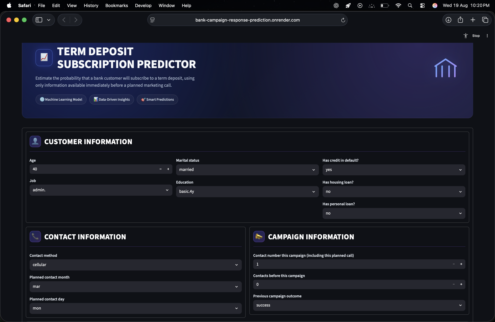
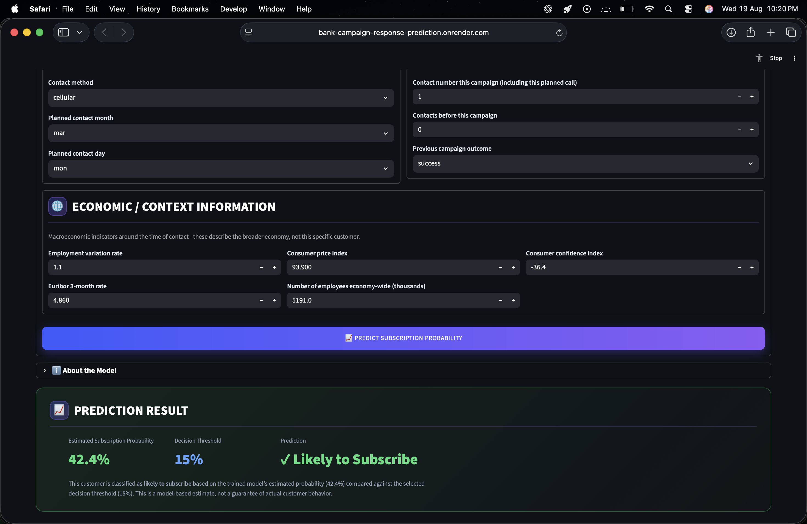

# Bank Marketing Campaign Response Prediction

An end-to-end machine learning system that predicts whether a bank customer
will subscribe to a term deposit — built to reflect a real, deployable
prediction scenario rather than a leaderboard-style notebook exercise.

**Live demo:** [bank-campaign-response-prediction.onrender.com](https://bank-campaign-response-prediction.onrender.com/)

## Overview

Given a customer's profile, contact history, and the current macroeconomic
context, the model estimates the probability that they'll subscribe to a
term deposit **before a planned marketing call is made** — so a bank can
prioritize who to contact with limited resources.

This is a portfolio project built to demonstrate the full ML lifecycle, not
just a notebook that reports an accuracy number: catching label leakage
before it inflates results, respecting the time-ordering of real data,
choosing a decision threshold defensibly, and shipping the result as a
tested, containerized, self-contained prediction service — the same
concerns that come up building ML systems for production.

## Business objective

Marketing teams can only contact a limited number of customers, so knowing
who is likely to subscribe *before* making a call lets a bank prioritize
outreach instead of contacting everyone. This model exists to support that
prioritization decision.

The 0.15 decision threshold is deliberately conservative in favor of recall
over precision: missing a customer who would have subscribed is treated as
more costly than contacting some who ultimately don't, since a phone call
is cheap relative to a missed subscription.

## How it works

```
Raw customer/contact/economic data
        │
        ▼
Feature engineering  (age group, prior-contact flag, etc.)
        │
        ▼
Preprocessing  (StandardScaler + OneHotEncoder)
        │
        ▼
Logistic Regression  →  subscription probability
        │
        ▼
Compare to threshold (0.15)  →  Likely / Unlikely to subscribe
```

All four steps live inside one scikit-learn `Pipeline`
(`src/pipeline.py`), serialized to `models/final_model.joblib`. The
Streamlit app (`app/streamlit_app.py`) is a thin UI layer: it collects raw
form input, hands it to `src/predict.py`, and displays exactly what comes
back — no ML logic duplicated in the UI.

**Tech stack:** Python, pandas, scikit-learn, Streamlit, Docker, pytest,
Jupyter/SHAP (for the exploratory notebooks).

## Application

The Streamlit interface collects a customer's profile, contact history, and
current economic indicators, then returns that customer's estimated
subscription probability. It's a thin UI over `src/predict.py` — the app
itself contains no ML logic, only what the serialized pipeline computes.



### Prediction output

Submitting the form returns three things: the estimated subscription
probability, the decision threshold (0.15) it's compared against, and the
resulting Likely / Unlikely classification.



## Key design decisions

- **No leakage.** `duration` (the call length) is the single strongest
  predictor in the raw data — and completely unusable, since it's only known
  *after* the call happens. It's excluded everywhere. See
  `notebooks/03_leakage_investigation.ipynb`.
- **Chronological split, not random.** The data is time-ordered, so the
  train/test split is the first 80% / last 20% by time — a random split
  would leak future information into training.
- **Threshold chosen on training data only.** The 0.15 decision threshold
  was selected via out-of-fold cross-validation on the training set, then
  evaluated (not re-tuned) on the held-out test set.
- **One self-contained pipeline.** Feature engineering, preprocessing, and
  the model are all steps inside a single scikit-learn `Pipeline`, so the
  serialized `.joblib` file takes raw customer data in and returns a
  probability out — no separate preprocessing code to keep in sync.

## Model

| | |
|---|---|
| Algorithm | Logistic Regression (`C=1`, `class_weight=None`, `max_iter=1000`) |
| Dataset | [UCI Bank Marketing Dataset](https://archive.ics.uci.edu/dataset/222/bank+marketing) — 41,188 rows, Portuguese bank, 2008–2010 |
| Features | 22 (client, contact, campaign, and macroeconomic fields — see `src/config.py`) |
| Decision threshold | 0.15 (selected via cross-validation on training data) |

**Test set performance** (chronological hold-out, n = 8,236):

| Accuracy | Precision | Recall | F1 | ROC-AUC | PR-AUC |
|---|---|---|---|---|---|
| 0.645 | 0.456 | 0.793 | 0.579 | 0.747 | 0.534 |

Full details and intended use are documented in
[`models/model_card.md`](models/model_card.md).

## Deployment

```
User
   │
   ▼
Streamlit UI
   │
   ▼
Prediction Pipeline  (feature engineering → preprocessing → Logistic Regression)
   │
   ▼
Subscription Probability
   │
   ▼
0.15 Decision Threshold
   │
   ▼
Prediction  (Likely / Unlikely)
```

The application is containerized with Docker (see `Dockerfile`) and
deployed on [Render](https://render.com/). The same container can be run
locally — see *Running with Docker* below.

## Limitations

- The dataset reflects historical Portuguese banking campaigns from
  2008–2010, not synthetic or current data.
- Historical customer behavior may not represent modern banking customers
  or economic conditions.
- The model estimates probability from learned patterns; it does not
  establish causal relationships between features and subscription
  behavior.
- The macroeconomic indicators (e.g. `euribor3m`, `cons.conf.idx`) are
  contextual — they describe the broader economy at the time of contact,
  not the individual customer.
- The live demo runs on Render's free tier, which may have cold-start
  delays after periods of inactivity.

## Project structure

```
notebooks/    01–08: data cleaning → EDA → leakage investigation →
              feature engineering → model comparison → tuning →
              final evaluation/threshold → explainability (SHAP)
src/          production code: config, feature engineering, preprocessing,
              pipeline assembly, training, prediction, evaluation
app/          Streamlit web application
models/       trained pipeline, threshold, and model card
tests/        pytest suite covering the prediction pipeline
Dockerfile    containerized deployment
```

## Running locally

```bash
python -m venv .venv && source .venv/bin/activate
pip install -r requirements.txt

# Train and serialize the model (writes models/final_model.joblib + threshold.json)
python -m src.train

# Launch the app
streamlit run app/streamlit_app.py
```

## Running with Docker

```bash
docker build -t bank-marketing-ml .
docker run -p 8501:8501 bank-marketing-ml
```

Then open `http://localhost:8501`.

## Testing

```bash
pytest
```

Covers model/threshold loading, prediction correctness, feature engineering,
serialization consistency, and input validation.

## Dataset

Not included in this repo. Download `bank-additional-full.csv` from the
[UCI Machine Learning Repository](https://archive.ics.uci.edu/dataset/222/bank+marketing)
and place it at `data/raw/bank-additional-full.csv`.
